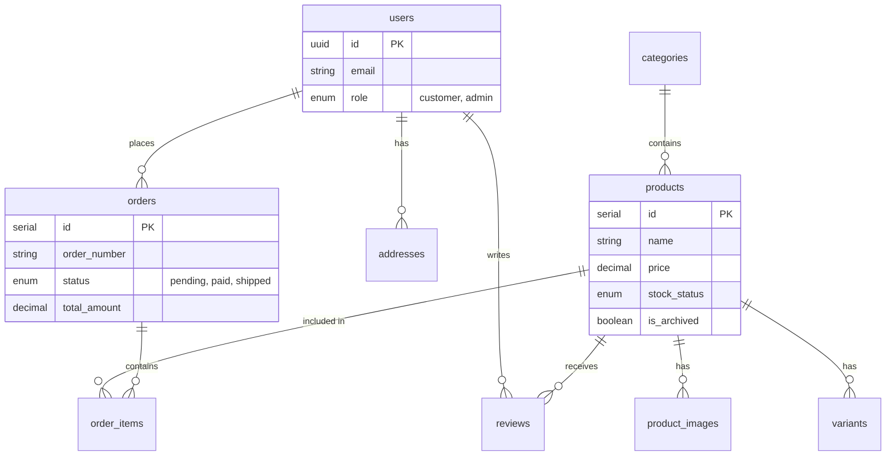

# System Architecture

## Overview
**FITS** is a modern e-commerce platform built for performance, scalability, and zero-cost operation. It leverages a serverless architecture to ensure high availability and low maintenance.

## Tech Stack
*   **Frontend & API**: Next.js 15 (App Router, Server Actions)
*   **Database**: Neon (Serverless PostgreSQL)
*   **ORM**: Drizzle ORM
*   **Authentication**: Supabase Auth (OAuth2)
*   **Styling**: Tailwind CSS + shadcn/ui
*   **State Management**: Zustand (Client) + React Query (Server/Async)

## Database Schema (Drizzle)
The database is managed via Drizzle ORM. The schema is defined in `lib/db/schema.ts`.

## Authentication Flow
We use **Supabase Auth** for secure user management.
1.  **Login**: User clicks "Sign in with Google/GitHub".
2.  **Redirect**: Initial request goes to Supabase.
3.  **Callback**: Supabase redirects back to `/auth/callback`.
4.  **Session**: The callback route exchanges the code for a session cookie.
5.  **Middleware**: `middleware.ts` runs on every request to refresh the session token if needed.

## Key Architectural Decisions
*   **Server Actions**: We use Next.js Server Actions for all data mutations (Create, Update, Delete). This avoids the need for a separate API layer for internal features.
*   **Soft Deletes**: Products are never truly deleted; `is_archived` flag is used to preserve order history.
*   **Dark Mode**: Implemented via `next-themes` with a `ThemeProvider` wrapper in `layout.tsx`.
